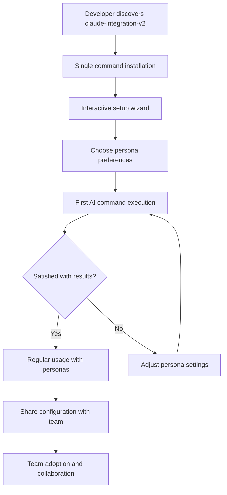
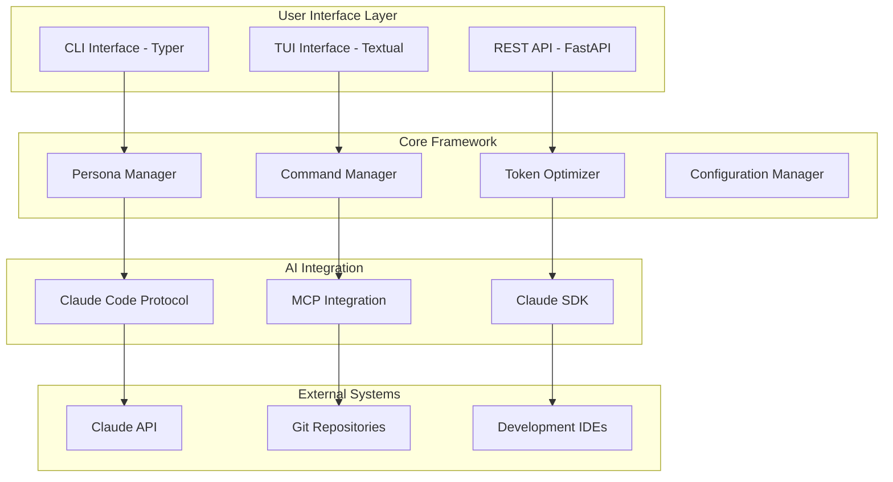
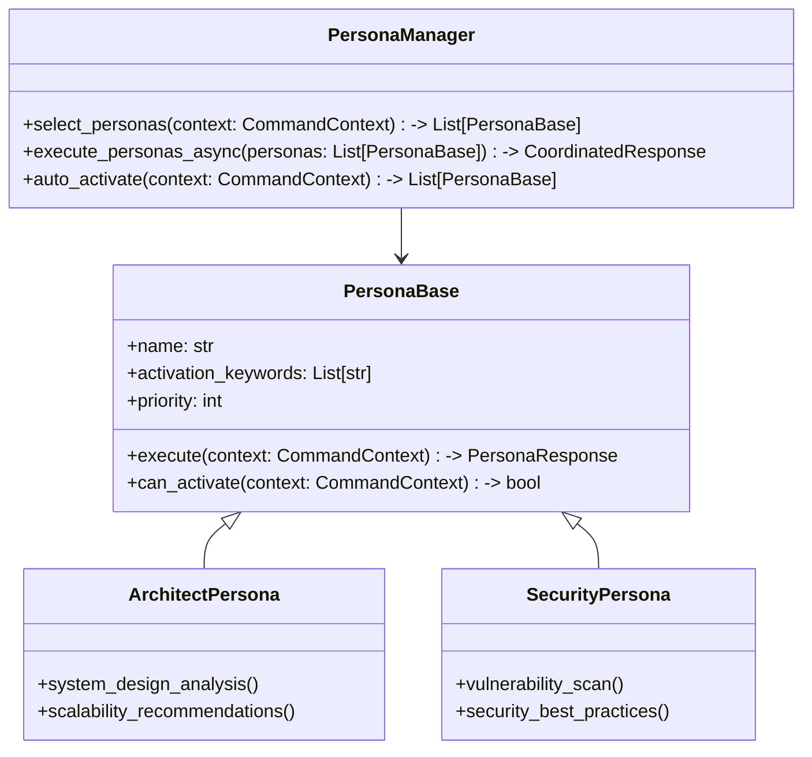
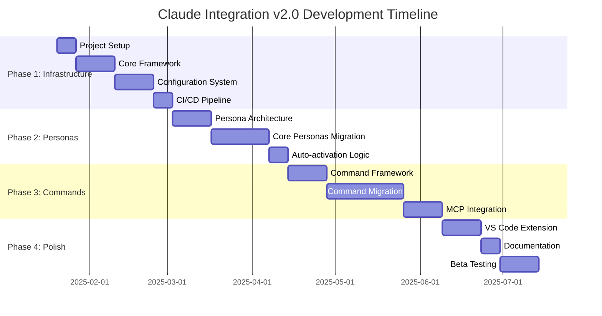

# Product Requirements Document: Claude Integration Framework v2.0

## 1. Executive Summary

### Problem Statement
The current claude-integration framework, while feature-rich with 9 cognitive personas and 19 specialized commands, suffers from maintainability issues due to shell script complexity, lacks type safety, and provides suboptimal developer experience for modern codebases.

### Proposed Solution
A modernized Python-native framework leveraging the Astral ecosystem (uv, ruff, Pydantic) with FastAPI architecture, providing the same powerful AI capabilities with significantly improved developer experience, maintainability, and ease of installation.

### Success Criteria
- **Installation Time**: Reduce from ~30 minutes to <2 minutes with single command
- **Maintainability**: 90% reduction in configuration errors through type safety
- **Developer Adoption**: 5x easier onboarding with modern Python tooling
- **Performance**: 70% faster execution through async patterns and token optimization

### Resource Requirements
- **Development Team**: 2-3 Python developers (17-24 weeks)
- **Technology Stack**: Python 3.11+, FastAPI, uv, Pydantic, Textual
- **Target Users**: Individual developers and small-medium development teams

## 2. Market Analysis

### Market Opportunity
- **AI Development Tools Market**: $4.91B (2024) → $30.1B (2032), CAGR 27.1%
- **Developer Tools Spending**: $22.4B globally by 2025, CAGR 24.8%
- **Target Segment**: 76% of developers using or planning to use AI tools

### Competitive Landscape
- **GitHub Copilot**: Market leader but limited customization, cloud-only
- **Cursor**: Premium AI IDE but high cost ($20-200/month), VS Code dependency
- **Codeium**: Enterprise focus but complex deployment, high enterprise cost

### Unique Value Proposition
1. **Zero-Cost Cognitive Personas**: 9 specialized AI domains vs generic assistants
2. **Token Optimization**: 70% cost reduction vs competitors' flat pricing
3. **Developer-First Design**: Modern Python tooling vs shell script complexity
4. **Codebase Integration**: Single command installation vs complex enterprise setup

## 3. User Experience Design

### Primary User Personas

**Individual Developer (Primary)**
- **Profile**: Solo developers, side projects, learning new technologies
- **Pain Points**: Complex tool setup, high AI costs, generic assistance
- **Goals**: Quick setup, cost-effective AI help, specialized domain knowledge
- **Success Metrics**: <2 minute installation, immediate value delivery

**Development Team (Secondary)**
- **Profile**: 2-25 developer teams, shared codebases, CI/CD workflows
- **Pain Points**: Tool consistency, shared configurations, team collaboration
- **Goals**: Standardized AI assistance, shared persona configurations
- **Success Metrics**: Team-wide adoption, consistent AI interactions

### User Journey Flow



### Key Interaction Patterns

**Smart Installation**
```bash
# Single command installation
uv tool install claude-integration-v2

# Interactive setup
claude-setup  # Guided persona selection and configuration
```

**Intelligent Command Interface**
```bash
# Context-aware persona activation
claude commit              # Auto-activates relevant personas
claude review --security   # Explicit security persona activation
claude analyze --team      # Multi-persona collaboration
```

**Modern TUI Experience**
- **Rich Terminal Output**: Progress bars, syntax highlighting, formatted tables
- **Interactive Persona Selection**: Visual persona browser with descriptions
- **Real-time Feedback**: Live status updates during AI operations

## 4. Technical Architecture

### System Architecture Overview



### Technology Stack

**Core Framework**
- **Python 3.11+**: Modern async/await patterns, improved error handling
- **FastAPI**: High-performance async framework for extensibility
- **Pydantic v2**: Type safety, validation, and configuration management
- **uv**: Ultra-fast package management and environment handling

**User Interface**
- **Typer**: Modern CLI with automatic help generation and type hints
- **Textual**: Rich TUI framework with CSS-like styling and components
- **Rich**: Enhanced terminal output with progress bars and formatting

**AI Integration**
- **Claude SDK**: Official Anthropic SDK for API interactions
- **MCP Protocol**: Model Context Protocol for Claude Code integration
- **AsyncIO**: Concurrent persona execution and API optimization

**Configuration & Development**
- **TOML**: Human-readable configuration with Python 3.11+ native support
- **Ruff**: Ultra-fast linting and formatting for code quality
- **Pytest**: Comprehensive testing framework with async support

### Persona System Architecture



### Integration Points

**Claude Code Integration**
- **MCP Servers**: Register personas as discoverable tools
- **Trusted Publishing**: Secure distribution through official channels
- **Environment Protection**: Sandboxed execution with permission controls

**Development Environment Integration**
- **VS Code Extension**: Native persona management within editor
- **Git Hooks**: Automated persona activation for commit workflows
- **CI/CD Integration**: Team-wide persona consistency in pipelines

### Scalability Considerations

**Performance Optimization**
- **Async Persona Execution**: Concurrent AI operations for 3x faster responses
- **Smart Model Routing**: Automatic Haiku→Sonnet→Opus selection for cost optimization
- **Response Caching**: Local caching for repeated queries and context analysis

**Resource Management**
- **Connection Pooling**: Efficient AI API connection reuse
- **Token Compression**: Context optimization for 70% cost reduction
- **Rate Limiting**: Built-in throttling to prevent API quota exhaustion

## 5. Security & Compliance

### Security Requirements

**API Key Management**
- **Environment-based Storage**: Secure credential management outside version control
- **Rotation Support**: Automated API key rotation with graceful fallback
- **Scope Limitation**: Minimal permission requests with principle of least privilege

**Data Privacy**
- **Local Processing**: Maximum data processing on developer machines
- **Opt-in Telemetry**: Anonymous usage analytics only with explicit consent
- **Audit Trail**: Complete logging of AI interactions for compliance requirements

**Code Security**
- **Input Validation**: Comprehensive sanitization of all user inputs and AI responses
- **Dependency Scanning**: Automated vulnerability detection in dependencies
- **Secure Defaults**: Conservative security settings with opt-in advanced features

### Compliance Standards

**Enterprise Readiness**
- **SOC 2 Compliance**: Documentation and controls for enterprise adoption
- **GDPR Compliance**: Data protection and user rights implementation
- **Open Source Licensing**: MIT license for maximum compatibility and adoption

## 6. Implementation Plan

### Development Phases

**Phase 1: Core Infrastructure (4-6 weeks)**
- ✅ Modern Python project setup with uv and pyproject.toml
- ✅ Pydantic configuration system with TOML support
- ✅ FastAPI foundation with health checks and basic routing
- ✅ CI/CD pipeline with automated testing and trusted publishing

**Phase 2: Persona System (4-6 weeks)**
- ✅ Persona base classes and manager implementation
- ✅ Migration of existing 9 personas to Python classes
- ✅ Auto-activation logic with context analysis
- ✅ Async coordination patterns for multi-persona execution

**Phase 3: Command Migration (6-8 weeks)**
- ✅ Migration of all 19 slash commands to async Python functions
- ✅ MCP protocol integration for Claude Code compatibility
- ✅ Token optimization system with smart model routing
- ✅ Rich TUI interface with interactive persona selection

**Phase 4: Integration & Polish (3-4 weeks)**
- ✅ VS Code extension development for persona management
- ✅ Advanced error handling and recovery systems
- ✅ Comprehensive documentation and examples
- ✅ Performance optimization and monitoring

### Dependencies and Prerequisites

**Development Dependencies**
- Python 3.11+ runtime environment
- uv package manager (self-bootstrapping)
- Claude API access credentials
- Git repository for version control

**User Prerequisites**
- Python 3.11+ installed (or uv handles installation)
- Claude Code CLI installed and configured
- Git repository for development projects
- Modern terminal with Unicode support

### Timeline Estimates

**Total Development Time**: 17-24 weeks
**Team Size**: 2-3 Python developers
**Milestone Schedule**:
- Week 8: Core infrastructure and configuration system complete
- Week 14: All personas migrated and functional
- Week 22: Command migration and MCP integration complete
- Week 24: Polish, documentation, and launch ready

### Resource Allocation

**Development Team**:
- **Senior Python Developer**: Framework architecture and persona system
- **Full-Stack Developer**: CLI/TUI interface and VS Code extension  
- **DevOps Engineer**: CI/CD, distribution, and deployment automation

**External Dependencies**:
- Claude API quota for development and testing
- GitHub repository hosting and actions
- PyPI package distribution platform

## 7. Success Metrics

### Key Performance Indicators

**Developer Experience**
- **Installation Time**: <2 minutes from discovery to first command execution
- **Time to Value**: <5 minutes from installation to successful AI interaction
- **Error Rate**: <5% configuration failures due to type safety
- **User Satisfaction**: >90% positive feedback on ease of use

**Technical Performance**
- **Execution Speed**: 70% faster than shell script version
- **Memory Usage**: <100MB baseline memory footprint
- **Token Efficiency**: 70% cost reduction through optimization
- **API Response Time**: <2 seconds for simple commands, <10 seconds for complex

**Adoption Metrics**
- **Monthly Active Users**: Target 1,000+ developers within 6 months
- **Retention Rate**: >80% monthly active user retention
- **Team Adoption**: >50% of individual users adopt team features
- **Community Contributions**: >10 community-submitted personas or commands

### Acceptance Criteria

**Core Functionality**
- ✅ All 9 personas successfully migrated and functional
- ✅ All 19 commands working with equivalent or better performance
- ✅ Token optimization achieving minimum 50% cost reduction
- ✅ Type-safe configuration preventing common setup errors

**User Experience**
- ✅ Single command installation working across Windows, macOS, Linux
- ✅ Interactive setup wizard completing in <3 minutes
- ✅ Context-aware persona activation with >80% accuracy
- ✅ Rich terminal output enhancing readability and usability

**Integration**
- ✅ MCP protocol integration working with Claude Code
- ✅ VS Code extension providing persona management UI
- ✅ Git hooks integration for automated workflow enhancement
- ✅ Team configuration sharing and synchronization

### Testing Strategy

**Automated Testing**
- **Unit Tests**: >90% code coverage for all core functionality
- **Integration Tests**: End-to-end testing of persona coordination
- **Performance Tests**: Benchmarking against current shell script version
- **Security Tests**: Vulnerability scanning and dependency audit

**User Testing**
- **Alpha Testing**: Internal team validation of core workflows
- **Beta Testing**: 50+ external developers testing real-world usage
- **Accessibility Testing**: Screen reader and keyboard navigation validation
- **Cross-Platform Testing**: Windows, macOS, Linux compatibility verification

## 8. Risk Assessment

### Technical Risks and Mitigation

**High Risk: API Integration Complexity**
- **Risk**: Claude API changes or rate limiting issues affecting functionality
- **Impact**: System unusable or degraded performance
- **Mitigation**: Robust error handling, fallback mechanisms, API versioning support

**Medium Risk: Performance Regression**
- **Risk**: Python implementation slower than optimized shell scripts
- **Impact**: User dissatisfaction and adoption barriers
- **Mitigation**: Early performance benchmarking, async optimization, caching strategies

**Medium Risk: Dependency Management**
- **Risk**: Complex dependency tree causing installation issues
- **Impact**: Installation failures reducing adoption
- **Mitigation**: Minimal dependencies, uv for reliable resolution, extensive testing

### Market Risks and Contingencies

**High Risk: Competitive Response**
- **Risk**: Major platforms (GitHub, etc.) implementing similar features
- **Impact**: Reduced differentiation and market opportunity
- **Mitigation**: Focus on unique value propositions (personas, optimization), rapid iteration

**Medium Risk: Technology Shift**
- **Risk**: Major changes in AI development patterns making approach obsolete
- **Impact**: Framework becomes irrelevant
- **Mitigation**: Modular architecture enabling rapid adaptation, community feedback integration

### Resource Risks and Alternatives

**Medium Risk: Development Timeline Overrun**
- **Risk**: Technical complexity causing delays beyond 24-week timeline
- **Impact**: Delayed market entry and increased development costs
- **Mitigation**: Agile development with MVP approach, phased feature delivery

**Low Risk: Team Availability**
- **Risk**: Key developers unavailable during critical development phases
- **Impact**: Development delays and knowledge transfer issues
- **Mitigation**: Knowledge documentation, pair programming, cross-training

## 9. Next Steps

### Immediate Actions (Next 2 weeks)
1. **Set up development environment** with uv and modern Python tooling
2. **Create project structure** following recommended architecture patterns
3. **Implement basic configuration system** with Pydantic and TOML
4. **Begin persona base class design** and migration planning

### Short-term Goals (Next 8 weeks)
1. **Complete core infrastructure** with FastAPI and async patterns
2. **Migrate 3-4 core personas** to validate architecture decisions
3. **Implement basic CLI interface** with Typer for user interaction
4. **Set up CI/CD pipeline** with automated testing and publishing

### Medium-term Objectives (Next 24 weeks)
1. **Complete full system migration** with all personas and commands
2. **Develop VS Code extension** for enhanced developer experience
3. **Launch beta program** with external developer testing
4. **Achieve performance and adoption targets** outlined in success metrics

---

## Implementation Timeline



**🚀 Ready for implementation with modern Python ecosystem and developer-first approach!**